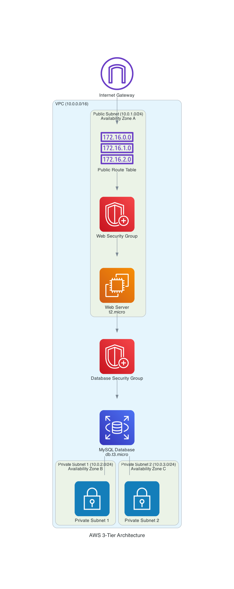

# AWS Infrastructure Project – Terraform Version

This project sets up a 3-tier infrastructure using Terraform.

## Architecture Diagram



To regenerate the architecture diagram, follow the instructions in the [Generating Architecture Diagrams](#generating-architecture-diagrams) section.

## Generating Architecture Diagrams

This project includes Python scripts to generate architecture diagrams using the [Diagrams](https://diagrams.mingrammer.com/) library.

### Prerequisites

1. Install [Graphviz](https://graphviz.org/download/) on your system:
   - macOS: `brew install graphviz`
   - Ubuntu/Debian: `sudo apt-get install graphviz`
   - Windows: Download installer from the Graphviz website

2. Install Python dependencies:
   ```bash
   pip install -r requirements.txt
   ```

### Generate Basic Architecture Diagram

Run the following command to generate a basic architecture diagram:

```bash
python create_architecture_diagram.py
```

This will create `aws_3tier_architecture.png` in the project root directory.

### Generate Detailed Architecture Diagram

For a more detailed diagram with additional elements and styling:

```bash
python create_detailed_architecture.py
```

This will create `aws_3tier_detailed_architecture.png` in the project root directory.

### Generate Japanese Architecture Diagrams

For Japanese versions of the architecture diagrams:

```bash
# Basic Japanese diagram
python create_architecture_diagram_ja.py

# Detailed Japanese diagram
python create_detailed_architecture_ja.py
```

These will create `aws_3tier_architecture_ja.png` and `aws_3tier_detailed_architecture_ja.png` respectively.